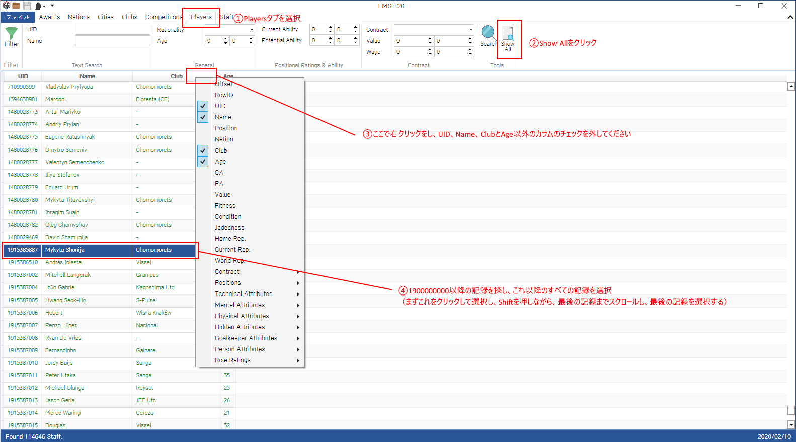
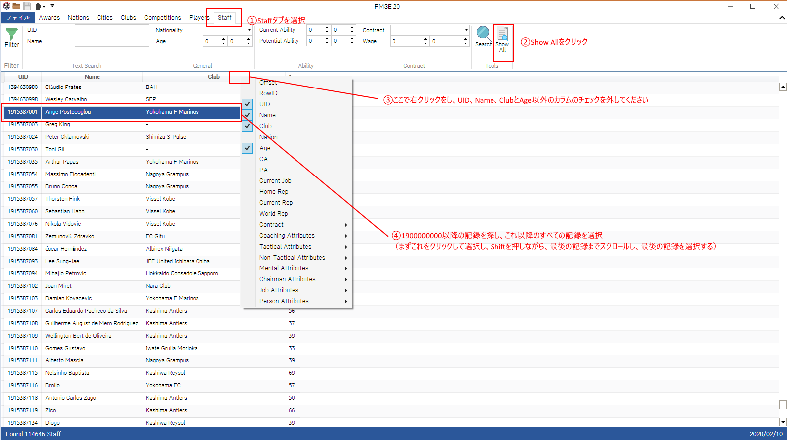

# FM2020 J リーグパック フェイスパック変換

Football Manager のカスタム顔画像は、XML ファイルで指定された ID（ゲーム内の ID、いわゆる UID）で画像を取得すること。しかし、残念ながらエディターで作成された選手やスタッフは、その ID は非固定です。
特にほかの MOD を利用する際、ID 衝突によりズレることがよくあることです。
また、J リーグパックに新たなバージョンがリリースされた際、選手削除や追加により ID が変わることもあります。
これはそれを解決するためのツールです。

ちなみに J リーグデータベース v2.0.0 を利用する方や、ほかの MOD を利用しない方ではこのツールを使う必要ありません。

## 使用前には

本ツールは Python 3 を利用するのでまず Python 3 をインストールしてください。また Python のライブラリ pandas を利用したので pandas もインストールしてください。
あと CSV の知識があれば良いと思います（Excel があれば CSV の知識は必要ないです）。

## やり方

### フェイスパックのダウンロード

まず、[EST Touiro 氏からフェイスパックをダウンロードしてください](http://estouiro.wp.xdomain.jp/2019/12/25/j-league-facepack-footballmanager-2020/)。最新バージョンは ver 2.1.1 です。
そのあと、Zip ファイルを解凍し、facepack フォルダに置いてください。

### FMSE から新しい ID リストを取得

ここでは一番厄介なことです。もっと良い方法があるかもしれませんが、ここでは確実な方法を紹介します。
まずは、[FMSE2020 をダウンロード](https://www.fmscout.com/a-fm-scout-editor-2020.html)し、インストールしてください。

そのあと、普通にゲームを起動し、利用したい MOD を全部チェックし、そのままゲームをスタートします（つまり、遊びたい環境でゲームを開始すること）、監督追加の画面まで待ちます。
監督追加の画面が出たら、インストールされた FMSE 2020 を起動し、「ファイル」をクリックし、「Load Game」をクリックします。

下のステータスバーをみて、ロードが完了したら、「Players」タブを選択し、「Show All」をクリックします。

UID 、 Name、ClubとAge 以外のカラムを非表示し、UID が 1900000000 以降の記録を探す（1900000000 以降は新規作成選手の ID なので）。そのまま 1900000000 以降全部の記録を選択し、Excel かテキストエディタにコピペします（Ctrl-C でコピー、Ctrl-V で貼り付け（ペースト））。最終では CSV フォーマットにしたいので、Excel がおすすめします（そのへんが詳しい場合、たぶん何がしたいかなんとなく読めると思います）。

そして「Staff」タブを選択し、同じことをします。今度は選手以降の行でコピペしてください。

### CSV 作成

これで FMSE の仕事は終わりました。あとは Excel で「ファイル」をクリックし、「名前を付けて保存」、フォーマットを UTF-8 の CSV を選択し、本コードの fmse フォルダに保存してください。ファイルネームは data.csv。

やっと下準備がほとんど終わりました。フォルダの配置は以下の画像通りです。

### 最後の設定

それではテキストエディタで config.py を開いてください。これは設定ファイルですが、「fm_data_path」のとこはパソコンの環境によって変わるので、自身の FM2020 のデータフォルダを探してください。デフォルトでは「`ドキュメント\Sports Interactive\Football Manager 2020`」ですが、自分の環境に合わせてフォルダパスを変更してください。ちなみにバックスラッシュが二つ「\\」です。

<b>new!</b> また、「fmse_data_date」を注目してください。名前が同じの選手を判別するため、年齢を計算する必要なので、ゲームの開始日を自分の環境に合わせて修正してください。正確ではFMSEのデータの日付ですが、上記に従う場合、ゲームの開始日で大丈夫です。

本ツールでは安全性を考慮するため古い画像の削除機能を提供しません。繰り返し使用だとまず「`ドキュメント\Sports Interactive\Football Manager 2020\Graphics`」の「j-league」フォルダを削除してください。

### ツールを実行

これですべての作業は終わりました。あとは「`python gen.py`」を実行してください。本ツールは自動的に画像ファイルと設定ファイルを FM2020 のフォルダにコピペするので、自分で画像をコピーする必要はありません。
コードが無事に終了したら、FM2020 に戻り、設定からスキンリロードしてください。顔画像は反映されます。
